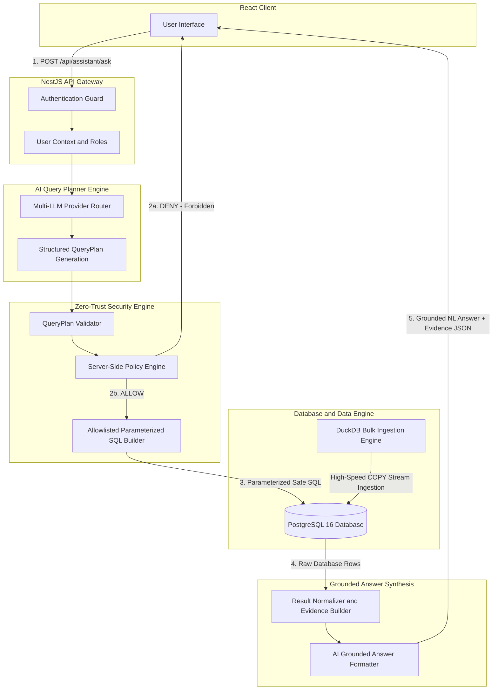
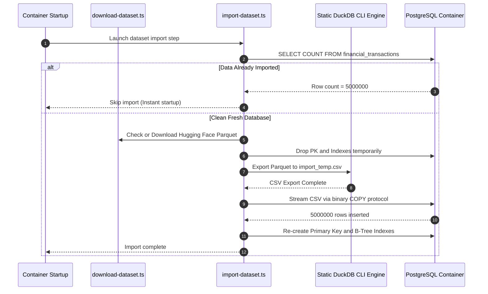

# 🏗️ Architecture & Security Pipeline

This document details the complete system architecture, multi-LLM integration, zero-trust RBAC policy enforcement, high-performance data ingestion pipeline, and grounded answer synthesis for the **AI Financial-Insights Assistant**.

---

## 1. End-to-End Execution Pipeline



---

## 2. Authorization Boundary & Security Principles

The core architectural directive of this platform is: **The AI is NEVER the authorization boundary.**

```
[ User Input ] ---> [ AI Model ] ---> [ Query Plan JSON ] ---> [ Server Policy Enforcement ] ---> [ Parameterized SQL ] ---> [ PostgreSQL ]
                                                                        │
                                                                   (RBAC GATE)
                                                                 Allow or Deny
```

### Security Guarantees:
1. **No Direct SQL Execution by AI**: AI models generate structured JSON query plans (`QueryPlan`), never raw SQL strings.
2. **Strict Server-Side Validation**: The `QueryPlanValidator` checks column allowlists, function allowlists, and enforces parameter safety (`$1`, `$2`).
3. **Field-Level RBAC Policy Check**: The backend `PolicyService` inspects requested fields (`transaction_id`, `account_id`, `customer_id`, `device_id`). If an unprivileged user (e.g., `Viewer` or `Analyst`) attempts to query sensitive entity identifiers, the server blocks execution immediately with HTTP `403 Forbidden`.
4. **Parameterized SQL Only**: All dynamic SQL queries are constructed using allowlisted identifiers and parameterized values to prevent SQL injection.
5. **Row Count Guardrails**: Queries requesting row listings are capped at `MAX_ENTITY_ROWS = 100` to prevent memory exhaustion or bulk data exfiltration.

---

## 3. High-Performance Bulk Data Pipeline (5 Million Rows)



### Ingestion Optimizations:
- **Parquet to CSV Conversion via DuckDB**: Converts 167MB compressed Parquet files into streaming CSV in under 3 seconds using C++ vectorized execution.
- **Index Drop / Re-creation Pattern**: Temporarily drops PostgreSQL indexes before bulk copying to eliminate B-Tree rebalancing overhead during inserts, then rebuilds indexes in parallel.
- **PostgreSQL COPY Protocol**: Uses node `pg-copy-streams` to push raw CSV chunks directly into PostgreSQL's internal binary parser without ORM serialization overhead.

---

## 4. Multi-LLM Provider Routing Architecture

The platform supports seamless switching between multiple leading LLM providers:

```
                          ┌───> Google Gemini 2.5 Flash Engine (@google/genai)
                          │
[ MultiLlmProviderRouter ]├───> Anthropic Claude 3.5 Sonnet (@anthropic-ai/sdk)
                          │
                          └───> OpenAI GPT-4o-mini (openai)
```

- **Dynamic Provider Selection**: The API allows callers to select their target provider or fallback automatically to the active provider key (`GEMINI_API_KEY`, `CLAUDE_API_KEY`, `OPENAI_API_KEY`).
- **Unified Schema Prompting**: All providers receive identical database schema definitions and output rules, producing strict, validated JSON `QueryPlan` outputs.
- **Evidence-Grounded Synthesizer**: After database execution, query results are formatted back to the selected LLM alongside execution metadata to generate natural, grounded answers backed by evidence.

---

## 5. Role-Based Access Control (RBAC) Matrix

| Permission Name | Viewer | Analyst | Admin |
| :--- | :---: | :---: | :---: |
| `VIEW_AGGREGATES` | ✅ | ✅ | ✅ |
| `VIEW_TRENDS` | ❌ | ✅ | ✅ |
| `VIEW_COMPARISONS` | ❌ | ✅ | ✅ |
| `VIEW_ENTITY_DETAILS` | ❌ | ❌ | ✅ |
| `VIEW_SENSITIVE_FIELDS` | ❌ | ❌ | ✅ |
| `MANAGE_USERS` | ❌ | ❌ | ✅ |

---

## 6. Directory Layout & Module Responsibilities

- **`backend/src/ai/`**: Multi-LLM providers, system prompts, query plan generation, grounded response formatting.
- **`backend/src/policy/`**: Policy engine, capability mapping, field-level access control.
- **`backend/src/query-execution/`**: SQL Builder service, query execution service, safety sanitizers.
- **`backend/src/auth/`**: Passport Google OAuth 2.0 strategy, Express session management, active user session switching.
- **`backend/scripts/`**: Parquet dataset downloader, DuckDB high-speed import script, dataset verification script.
